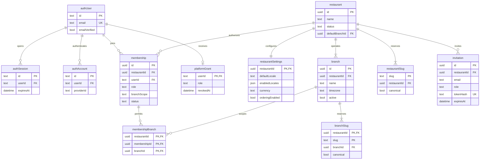
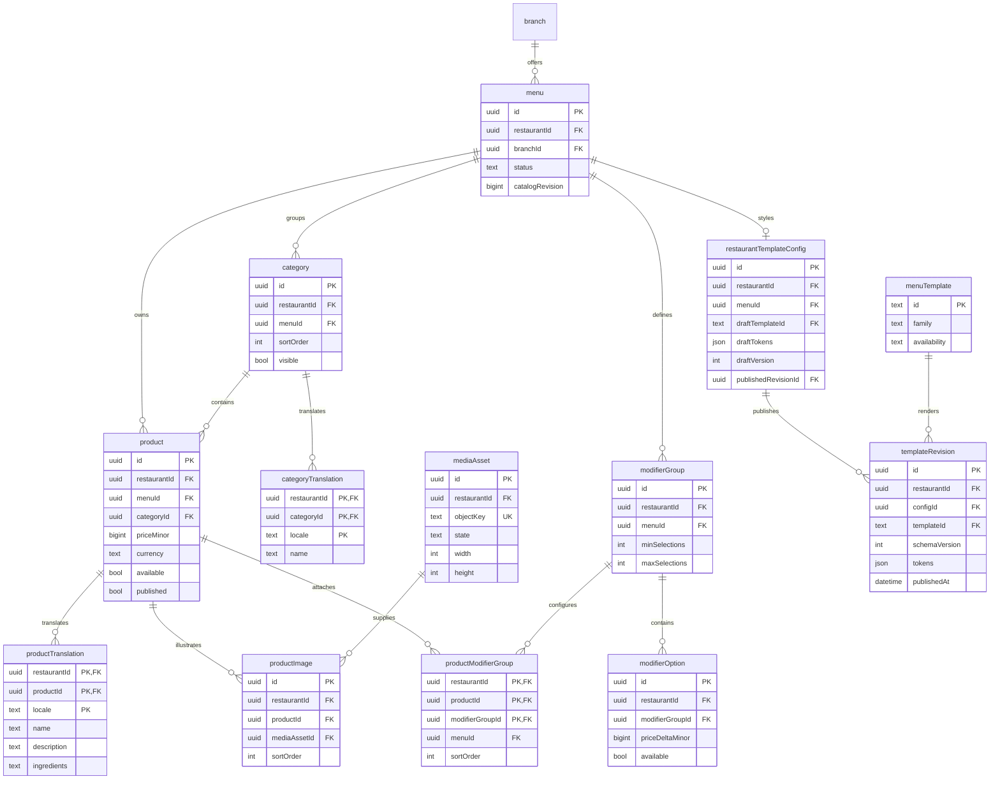
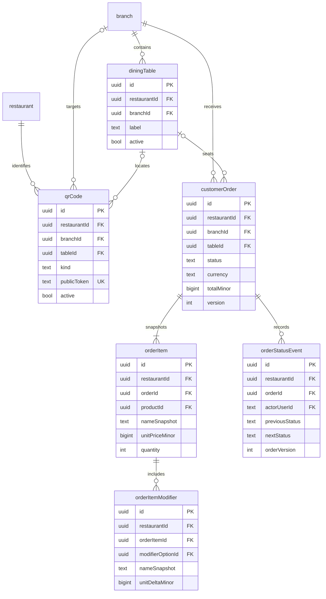
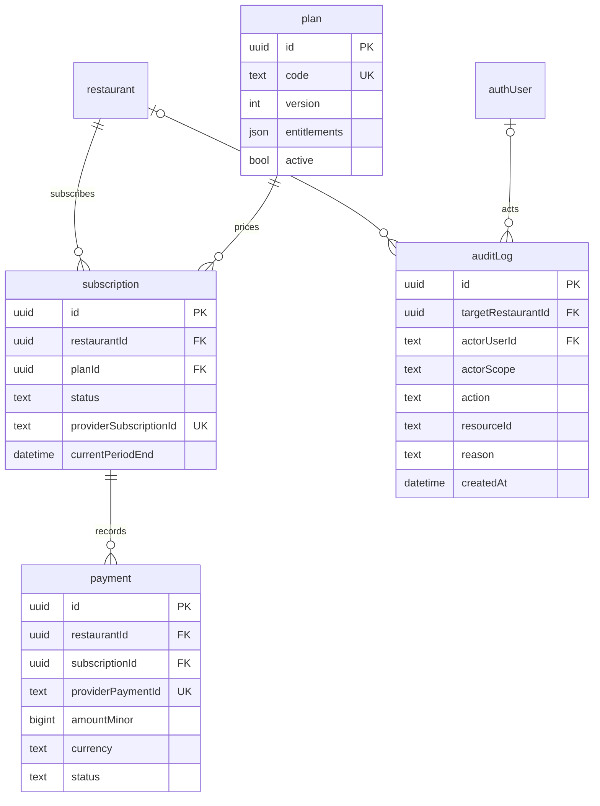

# Database model

Status: implemented through QR, orders, platform billing and analytics (migrations 0000–0008). Names in the conceptual model can differ from physical Drizzle columns; source schemas and versioned SQL are authoritative. See implementation.md for verification and ADR 006 for manual billing.

## Ownership and conventions

- Global: Better Auth identity/session/account/verification, platform grants, template catalog, plans, platform audit entries.
- Tenant-owned: every restaurant resource has a non-null `restaurant_id`, including translations, joins, media, revisions, QR codes, order lines, and billing records. Restaurant itself is the tenant root. A platform audit entry can have a nullable target restaurant; it is not a tenant-editable resource.
- Use UUID primary keys for application entities. Preserve the installed auth adapter's supported identity ID representation and reference it consistently; do not guess its generated schema.
- Mutable records have `created_at`, `updated_at` as UTC `timestamptz` and an integer version where concurrency matters. Immutable revisions/events have creation time and actor only. Branches store an IANA timezone, initially Asia/Tashkent.
- Nonnegative amounts are `bigint` minor units with an ISO currency code. Currency exponents determine formatting, including UZS; do not silently treat one unit as one minor unit. Serialize money as decimal integer strings to cross JSON boundaries safely. Bound all accepted amounts and quantities.
- All relationship tables with a tenant parent have a composite FK containing `restaurant_id`. An ID's unpredictability does not authorize access.
- Default IDs are internal. Public codes/tokens are separate random identifiers; server-provided public product IDs still require context validation when ordering.

## Identity and restaurant ERD

The diagrams are split by domain to remain readable. Repeated entities refer to the same tables. Attributes show important fields, not complete DDL; composite constraints are specified below.

Better Auth verification and recovery records use the installed adapter schema and are intentionally not redefined here. `PlatformGrant.role` initially has only PLATFORM_SUPER_ADMIN. Grants cannot be self-assigned or set via registration input.

Restaurant lifecycle: DRAFT, ACTIVE, SUSPENDED, ARCHIVED. Public access requires ACTIVE and a published active branch menu. Registration creates a DRAFT tenant; first authorized publication activates it only if onboarding requirements are met. Suspension is a platform action. Retain a suspension reason and actor in the audit log.

Enforce unique `(restaurant_id, user_id)` on memberships. `branch_scope` is ALL or ASSIGNED; OWNER and ADMIN require ALL, while CASHIER requires ASSIGNED with at least one permitted branch. MANAGER may use either. An ASSIGNED membership with no active branch grants has no branch access. Invitations include allowed branch assignments through `InvitationBranch(restaurant_id, invitation_id, branch_id)`, expire, and can be accepted once by the matching verified email in a transaction.

The restaurant/default-branch relationship uses a composite FK to `(branch.restaurant_id, branch.id)`. Allow the pointer to be null only during DRAFT onboarding; establish it before activation in the same transaction. Keep one canonical restaurant slug and one canonical slug per branch using partial unique indexes. All historical slugs remain reserved and are never recycled. Branch slugs are unique within a restaurant, including old aliases. Existence of a canonical slug for an active entity is a transactional invariant.

## Catalog and presentation ERD

Additional catalog fields: product `sort_order`, `featured`, `archived_at`, bounded standardized allergen codes, and ingredient text in translations. Modifier group and option translations are separate child tables keyed by `(restaurant_id, parent_id, locale)`. Media stores validated derivative metadata, checksum, byte count, processing status and localized alt text. Logos/covers reference tenant media with composite FKs; curated decorative assets use code-owned identifiers instead.

The first release enforces one menu per branch using unique `(restaurant_id, branch_id)`; supporting multiple menus later requires an explicit migration and QR/menu-selection behavior. A product belongs to exactly one menu/category. Add `UNIQUE(restaurant_id, menu_id, id)` to category and constrain product `(restaurant_id, menu_id, category_id)` against it. Product-modifier joins constrain both parents to the same menu. This prevents cross-menu references even inside a tenant. Reusable branch catalogs will need a later model, not removal of these checks.

Required translation: nonempty default-locale names before product/category publication. Optional locales fall back to the restaurant's default language. Public visibility requires published menu, visible category, published/unarchived product. Sold-out products may remain visible with disabled ordering. Allergen absence must not be presented as a verified allergen-free claim.

`MenuTemplate` is an application-seeded metadata catalog, not executable template code. `availability` is ACTIVE, RETIRED (not selectable; existing publications still work), or BLOCKED (requires reviewed fallback behavior). Supported renderer versions live in code. Each menu has one `RestaurantTemplateConfig`; its draft and published pointers are distinct. Immutable revisions store validated token snapshots and schema versions. The published pointer references `(restaurant_id, config_id, revision_id)` to prevent pointing to another menu's design.

Catalog edits to already-published items go live after transaction commit and revision advancement; there is no full catalog-draft/versioning subsystem in MVP. Newly created products default to unpublished. Menu-level publication controls overall visibility. Template draft/save/publish affects design only. This distinction must be explicit in the dashboard.

## QR and order ERD

`QRCode.kind` enforces exactly these shapes: RESTAURANT has no branch/table; BRANCH has a branch and no table; TABLE has both. A composite FK on `(restaurant_id, branch_id, table_id)` ensures the table belongs to that branch. Use the same relationship on table-scoped orders. A restaurant QR dynamically follows the configured default branch. All printed tokens remain stable unless explicitly revoked for misuse.

Initial ordering requires a valid active TABLE QR; branch/restaurant menus remain browse-only unless the guest later supplies a valid table context. Non-table/takeaway ordering is deferred. Store QR origin internally on the order for diagnostics, never in public receipts. Order fields also include bounded notes, created/updated timestamps, a per-branch display number, idempotency key, canonical request hash, and a hash of a high-entropy guest order-access credential. A QR token alone cannot read orders. Guests only receive their own receipt/status via a separate secure order credential.

## Billing and audit ERD — later phase

Plan versions are immutable once subscribed; `code` identifies that version, while a separate product key can group plan generations. Entitlements use a strict schema, not arbitrary executable feature rules. At most one active/trial/past-due subscription per tenant, enforced with a partial unique index. Provider events use a global deduplication table with unique `(provider, event_id)` when payment integration ships. No raw card data is stored. Payment and subscription states are provider-mapped, not inferred from a browser success URL.

`AuditLog` is append-only through restricted server operations; actors may be null for system activity but must have a recorded actor kind. Tenant audit reads filter the target and expose a safe projection. Retain actor/resource snapshots so ordinary archival does not destroy investigation history. Never store sessions, passwords, signed URLs, full webhook secrets, or arbitrary request bodies in audit metadata. Minimal security audit is introduced alongside tenant management, not delayed until billing.

## Constraints and query-driven indexes

For each tenant child parent target, declare the unique composite key required for its foreign keys. Drizzle supports composite constraints; generated migrations must be reviewed against the [official constraint documentation](https://orm.drizzle.team/docs/indexes-constraints).

| Constraint/index | Purpose |
| --- | --- |
| `membership(restaurant_id, user_id)` unique; `(user_id, status, restaurant_id)` index | Tenant authorization and restaurant switcher |
| `branch(restaurant_id, id)` unique; `menu(restaurant_id, branch_id)` unique | Enforce tenant branch relationships and one menu per branch |
| `category(restaurant_id, menu_id, sort_order, id)` | Ordered category read |
| `product(restaurant_id, menu_id, category_id, sort_order, id)` | Menu projection and category management; keyset tie-breaking |
| Translation `(restaurant_id, parent_id, locale)` primary key | One translation per locale/parent and scoped joins |
| Modifier joins `(restaurant_id, product_id, modifier_group_id)` primary key | No duplicated attachment; same-menu FKs |
| Table `(restaurant_id, branch_id, label)` unique | Unambiguous operational table labels |
| `qr_code(public_token)` unique | Public resolver lookup; still checks parent status |
| Order `(restaurant_id, branch_id, status, created_at, id)` | Open-order board and pagination |
| Order `(restaurant_id, branch_id, updated_at, id)` | Polling cursor; index cost justified by cashier reads |
| Order `(restaurant_id, branch_id, idempotency_key)` unique | Duplicate submission defense |
| Order `(restaurant_id, branch_id, display_number)` unique | Human-readable order lookup |
| Order event `(restaurant_id, order_id, order_version)` unique | One transition event per committed version |
| Audit `(target_restaurant_id, created_at, id)` | Tenant-scoped chronological review |
| Media `(restaurant_id, state, created_at)` | Tenant asset browsing and unfinished-upload cleanup |

Use check constraints for nonnegative price/amount, quantity bounds, min/max selection relationships, supported locales, token/config versions, and QR shape. Initial modifier deltas are nonnegative (discounting is later), and selection cardinality is checked server-side against the product's attached groups. Sum-of-rows totals, at-least-one-owner, and cross-record active-state conditions require transactions, not misleading row CHECK constraints. Do not add redundant single-column indexes automatically when an existing composite prefix serves the query.

## Order integrity and concurrency

1. Bound and validate input (implemented maxima: 50 lines, quantity 1–99 per line, note 500 characters, allowlisted locale, unique selected options). Resolve QR restaurant/branch/table on the server. Enforce active tenant, ordering flag, branch and published menu.
2. Validate an idempotency key and canonical request hash, scoped to restaurant/branch. Reuse returns the existing result only for the same payload and guest credential; a different payload gives a conflict. Use a guest order credential created on the first checkout attempt and retained across network retries; persist only its hash. Do not expose receipts to anyone who guesses an idempotency key.
3. In a short database transaction, re-check authoritative state and read current products, options, prices, and currency with locks sufficient to serialize conflicting edits. Lock restaurant/settings/branch/menu control rows consistently (shared for order reads, exclusive for relevant updates); catalog mutations take the menu lock before touching products/options. Multiple orders may share read locks, while a catalog edit waits. Test this protocol on real PostgreSQL to avoid relying on a default isolation level alone.
4. Reject unpublished, foreign-branch, unavailable, detached, or invalid modifier selections. Recompute totals server-side with integer arithmetic. If the displayed price changed, return a price-change response requiring reconfirmation; never silently charge a higher amount. There is no inventory reservation promise in MVP.
5. Insert the order, item/modifier snapshots, and initial state event atomically. The unique idempotency constraint arbitrates simultaneous retries. Read the existing result after a uniqueness conflict in a valid transaction context. Generate display numbers through a transactional per-branch counter, not `max + 1`.
6. A status mutation validates actor scope and the allowed edge, then conditionally updates by restaurant, branch, ID, expected status/version. Zero updated rows means conflict or inaccessible resource; return the appropriate safe response and refresh. Record status event/audit in the same transaction. A duplicate acknowledgement must not produce a duplicate transition.

Transitions: NEW → ACCEPTED or CANCELLED; ACCEPTED → PREPARING or CANCELLED; PREPARING → READY or CANCELLED; READY → COMPLETED. COMPLETED and CANCELLED are terminal. Cancellation requires a reason. Money and original item snapshots do not change with later product edits. The order workflow is separate from any future payment/refund state machine.

## Retention, deletion, and migrations

Archive restaurants, branches, products, tables, and templates referenced by history. Restrict destructive cascades into orders, payments, revisions, or audit. Cascade only truly dependent ephemeral/editorial children where no historical record is lost. Use soft revocation for QR codes and memberships. Customer-order snapshots preserve names/prices even if optional source references are later removed through a reviewed retention process.

Retention durations for order data, billing, analytics, audit, and deleted-account personal data must be set before production based on operational and applicable requirements; they are not guessed as legal advice here. Backups also need an expiry and restore procedure. Owners cannot delete an account/tenant in a way that bypasses owner transfer, financial retention, or shared membership checks.

Migration order: (1) installed auth schema, (2) tenant/membership/branch/slug/settings and minimal audit, (3) catalog/translations/media/modifiers, (4) template metadata/config/revisions, (5) tables/QR, (6) orders/counter/events, (7) billing/provider events. The first public-menu phase adds the needed publication/revision fields if not already in catalog. Later-phase entities are not all created up front.

Each migration is generated/reviewed, committed, and tested on an empty DB and the previous schema. Data migrations use expand/backfill/contract when needed. Use a deployment migration role separate from the restricted runtime role. Treat destructive rollback as data restoration or a reviewed forward fix, not automatic down-migration. Database integration tests must prove cross-tenant and cross-menu FKs reject malformed references, not just that application queries happen to filter correctly.

## Implemented migrations through 0008

Nine versioned migrations create 44 tables, including auth, tenant/branch memberships, relational catalog translations, media metadata, template drafts/revisions, stable QR/table context, immutable order snapshots/events, plan/subscription/manual-payment records, support inbox and anonymous analytics events. All migrations and a schema backup/restore were verified in separate empty local PostgreSQL databases. No production schema changes have been made. Billing payment references and analytics menu/product references have composite tenant constraints. See ADR 006 for manual billing and retention semantics.
